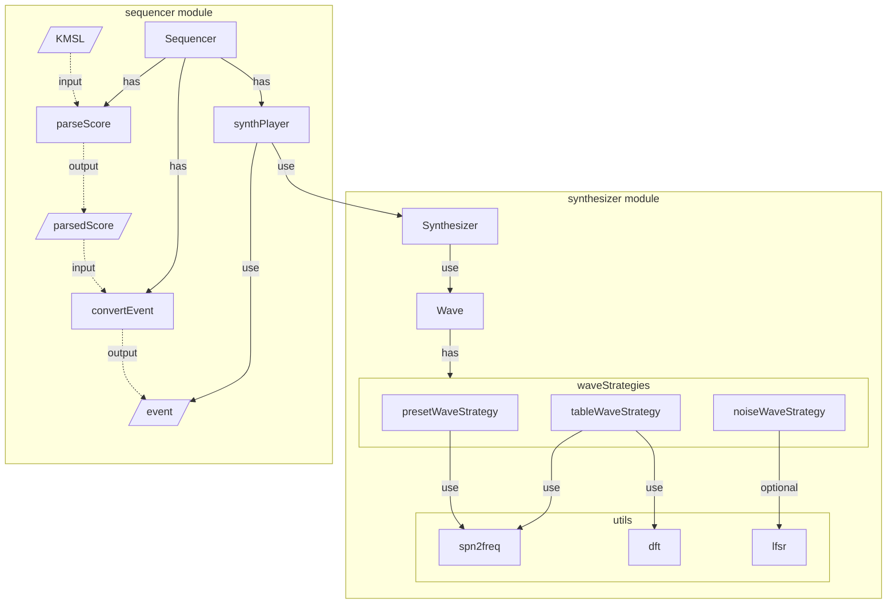

# KOBO Audio Package

## Purpose

This package is an audio processing unit for JavaScript mini-games.  
The synthesizer module generates and plays waveforms (Wraps the Web Audio API), and the sequencer module plays the synthesizer from the musical score format "KMSL".

## Features

- Synthesizer
    - Waveforms
        - Preset
            - Sine
            - Square
            - Sawtooth
            - Triangle
        - Wavetable (4-bit samples)
        - Noise
            - Random (Default)
            - LFSR
            - Custom
    - Multichannel
    - Detune
    - Sweep
    - Envelope (ADSR)
    - LFO
        - Vibration
        - Tremolo
- Sequencer
    - KMSL parser
    - Synth player

## Component diagram

## Processing flow

### Synthesizer

### Sequencer

## Example

### Synthesizer

### Sequencer
